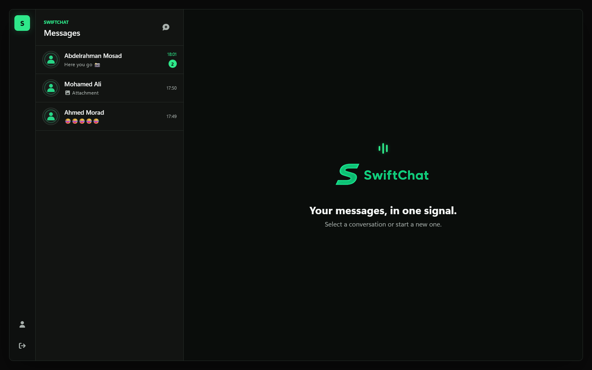
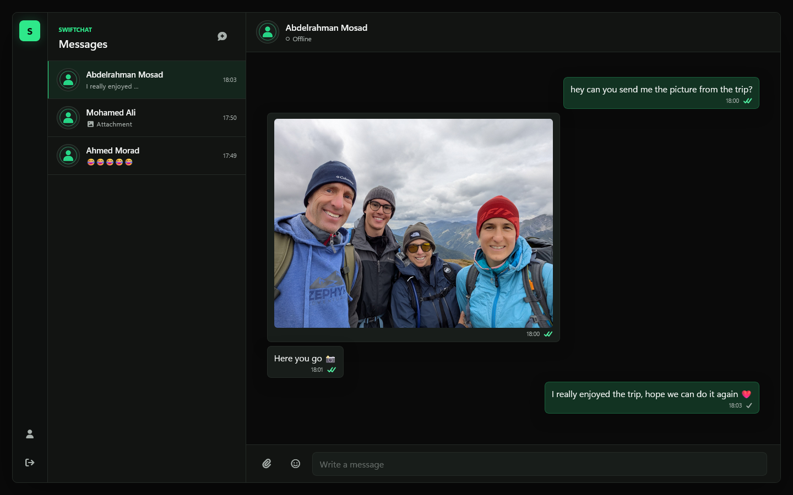
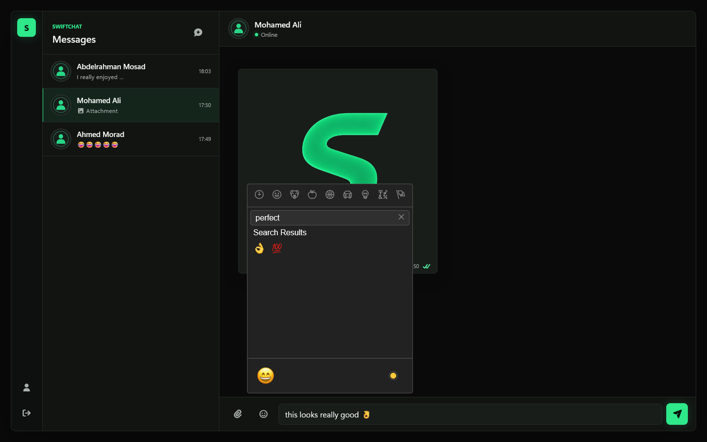
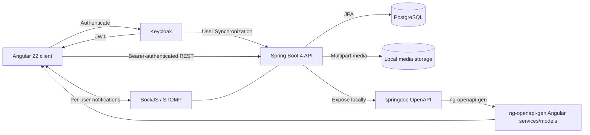

<p align="center">
  
</p>

# SwiftChat

SwiftChat is an authenticated messaging application that pairs an Angular client with a Spring Boot API, PostgreSQL persistence, Keycloak identity, and per-user STOMP notifications.


> SwiftChat currently runs as a local development environment.

## Product Preview

<p align="center">
  
</p>
<p align="center"><em>Workspace with conversation previews.</em></p>

<table>
  <tr>
    <td width="50%"></td>
    <td width="50%"></td>
  </tr>
  <tr>
    <td align="center"><em>Real-time conversation,Image attachment and delivery state.</em></td>
    <td align="center"><em>Emoji interaction.</em></td>
  </tr>
</table>

## Architecture



## Engineering Highlights

- Spring Security validates Keycloak JWTs for stateless API authentication and maps scope plus `resource_access.account.roles` to Spring authorities when that claim is present.
- A request filter synchronizes authenticated user profiles from JWT claims into PostgreSQL.
- One-to-one chat creation reuses an existing conversation for either ordering of the same participant pair.
- Real-time messaging uses the Angular SockJS/STOMP client subscription and Spring user-destination notifications for real time updates.
- Chat responses derive unread counts from messages addressed to the current user with `SENT` state; messages transition to `SEEN` through the API.
- Multipart image uploads are stored under per-user directories on the local filesystem.
- `springdoc-openapi` exposes local Swagger/OpenAPI, and `ng-openapi-gen` generated the checked-in Angular services and models.

## Features

- Keycloak sign-in and authenticated API access
- One-to-one conversation creation and history
- Real-time text and image notifications through the SockJS/STOMP subscription
- Presence, unread counts, timestamps, and sent/seen indicators
- Image attachments and emoji interaction
- Responsive messaging workspace

## Technology Stack

| Area | Technology |
| --- | --- |
| Frontend | Angular 22, TypeScript 6, Bootstrap, SockJS/STOMP, Keycloak JS, openapi-gen |
| Backend | Java 17, Spring Boot 4.1, Spring MVC, Spring Security OAuth2 resource server, Spring Data JPA, Spring WebSocket, springdoc-openapi |
| Data and infrastructure | PostgreSQL, Keycloak 26, Docker Compose, local filesystem media storage |

## Run Locally

### Prerequisites

- Java 17
- Node.js with npm 11-compatible tooling
- Docker with Docker Compose

1. Start PostgreSQL and Keycloak from the repository root:

   ```bash
   docker compose up -d
   ```

2. Open [Keycloak](http://localhost:9090) and sign in with `admin` / `admin` (development-only credentials; change them outside local development).
3. Create a realm named `SwiftChat`.
4. In that realm, create a public client named `SwiftChat`. Turn client authentication off, enable the standard flow, set the valid redirect URI to `http://localhost:4200/*`, and set the web origin to `http://localhost:4200`.
5. Start the backend from `SwiftChat/`:

   ```bash
   ./mvnw spring-boot:run
   ```

   On Windows:

   ```powershell
   .\mvnw.cmd spring-boot:run
   ```

7. Start the frontend from `SwiftChat-UI/`:

   ```bash
   npm install
   npm start
   ```

   8. Open [http://localhost:4200](http://localhost:4200).

Notes:

PostgreSQL uses `username` / `password` and Keycloak uses `admin` / `admin` as local development credentials.

The backend runs on `http://localhost:8080`; Keycloak runs on `http://localhost:9090`.

## API Overview

| Method | Endpoint | Purpose |
| --- | --- | --- |
| `GET` | `/api/v1/users` | List users except the authenticated user |
| `GET` | `/api/v1/chats` | List the authenticated user's chats |
| `POST` | `/api/v1/chats?senderId={senderId}&recipientId={recipientId}` | Create or retrieve a one-to-one chat; `senderId` and `recipientId` are query parameters |
| `GET` | `/api/v1/messages/chat/{chatId}` | Retrieve a chat's message history |
| `POST` | `/api/v1/messages` | Persist a message |
| `POST` | `/api/v1/messages/upload-media?chatId={chatId}` | Upload and persist an image message; `chatId` is a query parameter and `file` is a multipart form field |
| `PATCH` | `/api/v1/messages` | Mark received chat messages as seen |
| SockJS/STOMP | `/ws` | Establish the real-time notification channel |

## Repository Structure

```text
SwiftChat/
|-- SwiftChat/        Spring Boot backend
|-- SwiftChat-UI/     Angular frontend
|-- api-docs/         Exported OpenAPI document
|-- docs/screenshots/ Product screenshots
|-- Media/            Brand assets
`-- docker-compose.yml
```

## Current Scope

- One-to-one conversations
- Local development deployment
- Local filesystem media storage
- Manually provisioned Keycloak realm and client
- Unpaginated collections and message history
